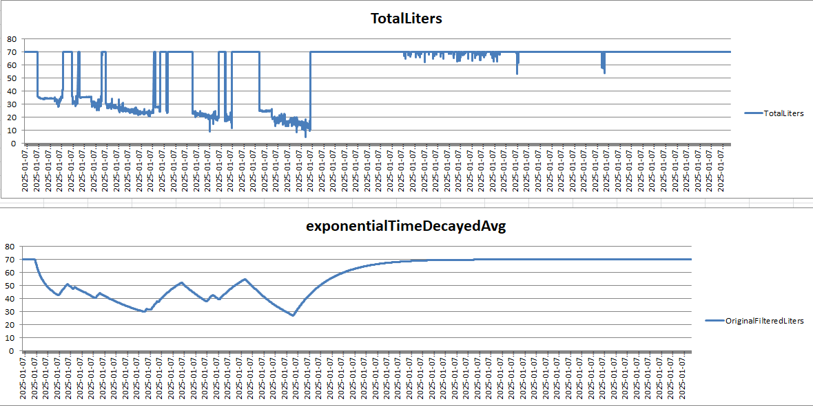

# uptime.codechallenge

## How Run

```bash
Docker compose up
```

after that run the api project

```bash
cd src/uptime.codechallenge.api
dotnet run
```

application will try to load and dispath the historical data from excel file to kafka after data is in kafka applicaton will setup the clickhouse ingestion and api will be available in moments.

you can access swagger and use the fuelLevel api to test the solution

`valid date:`

`2025-01-07 13:23:23`


## How it works

linear interpolation was used to calibrate the voltage to liters

This visualization is of applying exponentialTimeDeceyedAvg to raw calibrated, this is a primitive example and a more sophisticated model like kalman filter could be tuned for the optimal efficiency.

TotalLiter is the raw data of date 2025-01-07



## ELT

ELT is much faster than ETL when it comes to ingestion first mindset
ClickHouse is utilized to implement on pipline to load the data in a OLAP database ready for analitical queries.

## Data Partitioning

Current FileSystem and Table Format is based on clickhouse internal but in could be easly substituted for S3 file system and open table format like Parquet.

## Horizantal Scaling

By Increasing the kafka partition and clickhouse consumer instances you can easly scale out the solution.

## BDD

Gherking test scenario is available, test implementation is not done!
